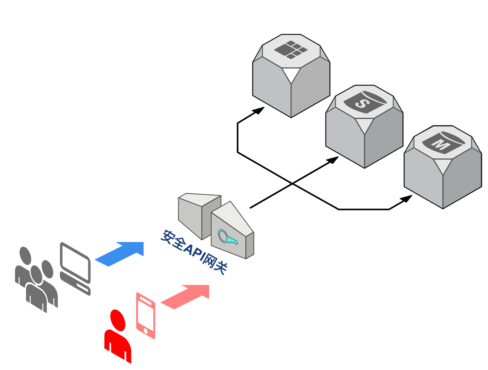
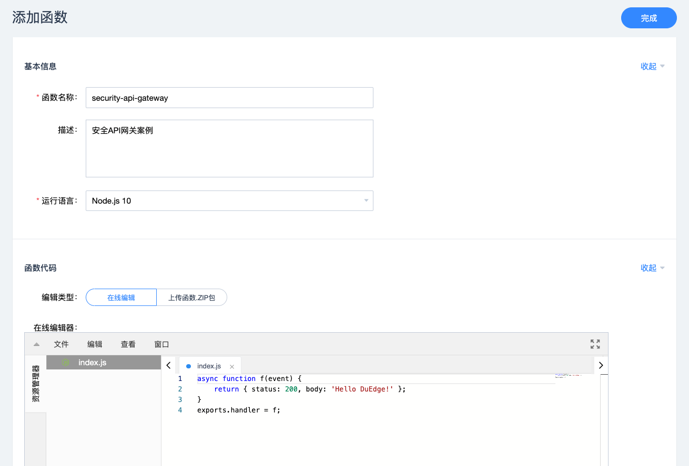
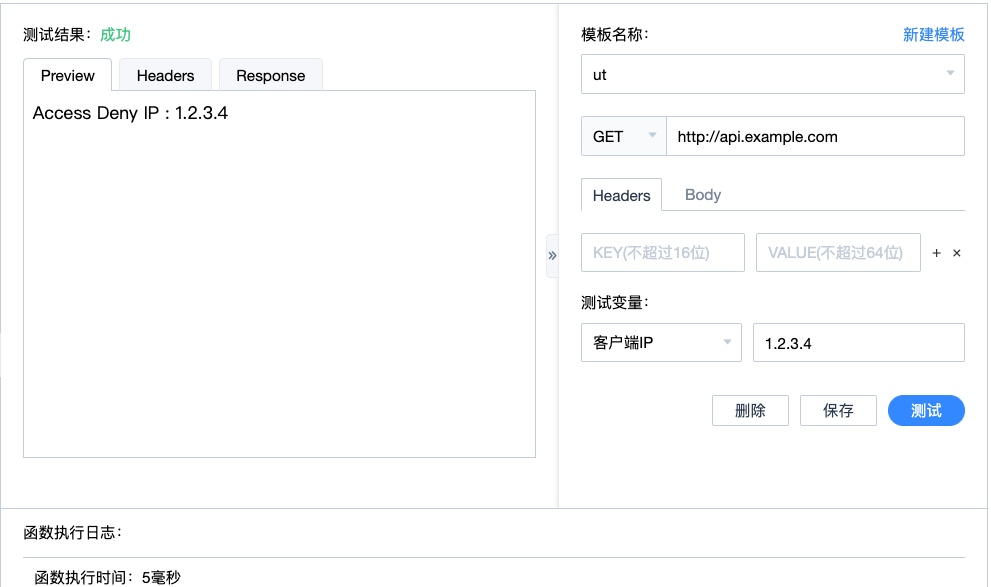
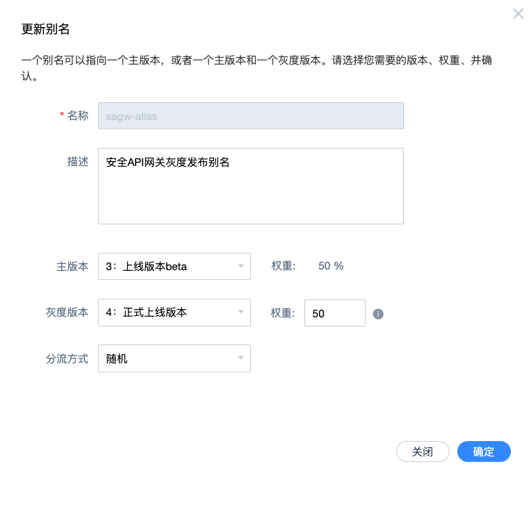
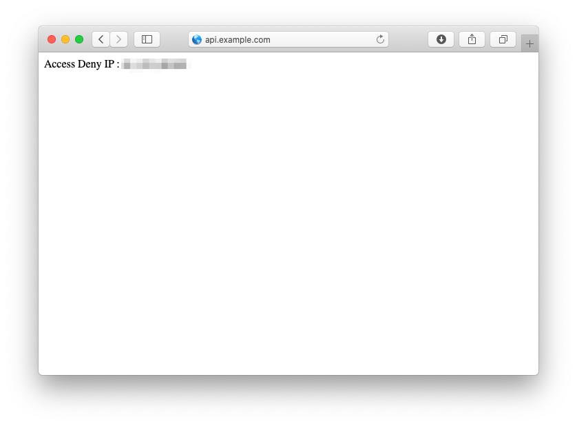

# 安全API网关DuEdge部署最佳实践

[TOC]



通过本教程，我们将学习如何通过DuEdge快速实现一个可实际部署的安全API网关，防止恶意客户端访问您的服务。

随着您的业务不断发展，需要通过API接口对接越来越多的业务使用者，这个时候就会面临一个的问题：如何让使用者安全高效的调用API接口。此时，部署一个集验证、安全检查、限流、低延时等功能于一身的安全API网关变得尤为重要。

接下来我们将通过DuEdge来实现一个轻量级的安全API网关，对非法请求的客户端IP进行拦截。借助DuEdge的FaaS（Function as a service）能力，您完全有可能在此基础上实现功能更强大的安全API网关。

通过此教程，您可以学到：

1. 如何实现函数
2. 如何测试功能
3. 如何做灰度部署


## 前置工作

为完成本教程，您需要事先做如下准备工作：

1. 注册DuEdge账号，获取开发者AccessKey和SecretKey；
2. 接入自己的域名，参考[接入域名流程](https://duedge.baidu.com/help/doc.html#/4_kuaisurumen/2_jieruyuming.md)；
3. 安装命令行工具，参考[DuEdge命令行工具](https://duedge.baidu.com/help/doc.html#/7_kaifazhinan/12_minglinghang/minglinghang.md)；


## 实践方案

### 创建项目

创建Node.js项目，DuEdge支持Web界面和命令行两种方式操作，Web界面简单易用，命令行适合嵌入脚本执行。

* 通过DuEdge的Web界面创建初始函数：



* 通过DuEdge命令行工具创建初始函数：

```
$ duedge configure --access-key=<your access key> --secret-key=<your secret key>
$ duedge init-function --runtime 'Node.js 10'
```

### 函数实现

我们会对访问的客户端IP地址进行检查，如果客户端IP在IP黑名单中则直接拒绝访问，否则调用远程服务检查IP地址是否存在风险，结果缓存在本地KV里加速近期查询。IP风险检查服务可以使用第三方服务，或者由您自己实现，这里只是为说明如何使用远程方法调用，DuEdge函数API也有IP威胁等级接口`event.security.IP.risk()`。

完整函数实现代码如下：

```
var util = require('util');
const deny_page = `
<html>
<body>Access Deny IP : %s</body>
</html>
`

async function handler(event) {
    const console = event.console;
    const request = event.request;
    const clientip = event.request.clientIp;

    // 检查是否命中全局KV中IP黑名单
    let v = await event.kv.getGlobal(clientip).catch(err => {
        console.log(err);
    })

    if (v) {
        // 命中全局KV中的IP黑名单
        return { status: 403, body: util.format(deny_page, clientip) };
    }

    // 检查本地KV缓存是否允许此IP访问
    v = await event.kv.get(clientip).catch(err => {
        console.log(err);
    });

    if (v) {
        let j = JSON.parse(v);

	     // 被允许则继续访问源站API接口，否则拒绝请求
        if (j.deny === "no") {
            return request;
        } else {
            return { status: 403, body: util.format(deny_page, clientip) };
        }  
    }
	    
    // 无本地KV缓存则调用远程服务检查IP地址是否存在风险
    var result = await event.fetch('http://api.example.com/checkip?ip=' + clientip);
    let j = JSON.parse(result);

    // 将结果缓存在本地KV中10分钟
    await event.kv.set(clientip, result, 600).catch(err => {
	    console.log(err);
    });

    // 被允许则继续访问源站API接口，否则拒绝请求
    if (j.deny === "no") {
        return request;
    } else {
        return { status: 403, body: util.format(deny_page, clientip) };
    }

    // 其他情况皆拒绝访问
    return { status: 403, body: util.format(deny_page, clientip) };
}

exports.handler = handler;
```

在这个函数实现中，我们使用到的功能包括：

1. 远程访问
2. 全局KV存储/本地KV存储
3. 打印调试log

### 添加IP黑名单

我们在全局KV里配置IP黑名单，通过全局KV可以将配置同步到DuEdge所有节点上，非常适合全局配置下发等场景。

通过DuEdge的OpenAPI可以非常简单的配置全局KV，参考文档[创建用户自定义域名KV配置](https://duedge.baidu.com/help/doc.html#/7_kaifazhinan/11_APIcankao/9_KVpeizhixiangguan/9.1_chuangjianyonghuzidingyiyumingkvpeizhi.md) 。

其中，payload可以按如下配置，添加`1.2.3.4`为IP黑名单：

```
payload = {}
payload['domain'] = 'example.com'
payload['key'] = '1.2.3.4'
payload['value'] = 'deny'
payload['ttl'] = 600
```

## 测试函数

我们可以通过Web界面进行函数功能测试，传入不同的客户端IP进行功能验证，并且可以将测试用例单独存成模版。



我们也可以通过命令行进行函数测试，执行如下命令：

```
$ duedge invoke --function-name security_api_gateway --method GET --url http://api.example.com --environment="{\"ip\": \"1.2.3.4\"}"
```

返回结果为JSON结构的数据：

```
{
    "result": {
        "body": "<html><body>Access Deny IP : 1.2.3.4</body></html>",
        "cost_time": "16",
        "error_code": "0",
        "header": {
            "Content-Type": "text/html",
            "Date": "Fri, 28 Feb 2020 08:19:05 GMT",
            "Server": "yunjiasu",
            ......
        },
        "log": "......",
        ......
    },
    "success": true
}
```

## 灰度部署

我们使用灰度部署新版本函数上线，最大程度减少函数Bug对线上业务的影响。DuEdge的灰度发布功能提供了按比例切换线上流量到不同版本函数的能力，如果上线过程中出现问题可以进行快速回退。

如下图中，我们将线上50%的流量切到新版本函数执行：




## 上线效果

将函数部署上线之后，当一个非法客户访问您的API接口时会被拦截，得到一个403错误，而正常客户端可以访问API接口。

依托DuEdge分布式网络，在全国各地的客户端都可以获得低延时的访问，非法请求在DuEdge边缘网络已经被拦截，这就减少了API源站的无效请求量，即节省了API源站的带宽又节省了大量计算资源。



## 相关资源

1. [DuEdge官网开发指南](https://duedge.baidu.com/help/doc.html#/1_chanpinjieshao/1_DuEdgepingtaijieshao.md)
2. [DuEdge函数示例代码](https://github.com/baidu/duedge-recipes)

